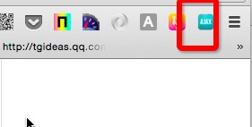

#### 安装依赖

```shell
npm install
```


#### 生成插件

```shell
sh build.sh
```


#### 开发

```shell
	打开chrome扩展程序，选择”已加载解压的扩展程序” -> 选着该项目生成的build文件夹
```


#### 页面调试


添加本地调试地址


#### tips

调试过程中发现bnjs 中API没有你所需要的，直接去该项目下的build/js/bnjs.js 更改，不要关心chrome上的from cache。这个bnjs随时加载最新